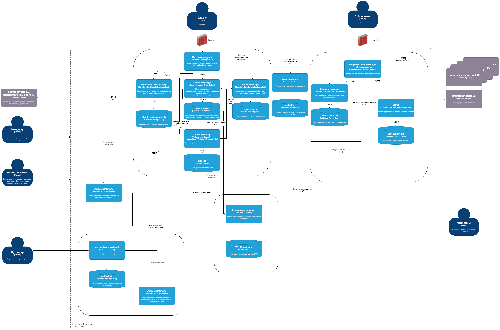
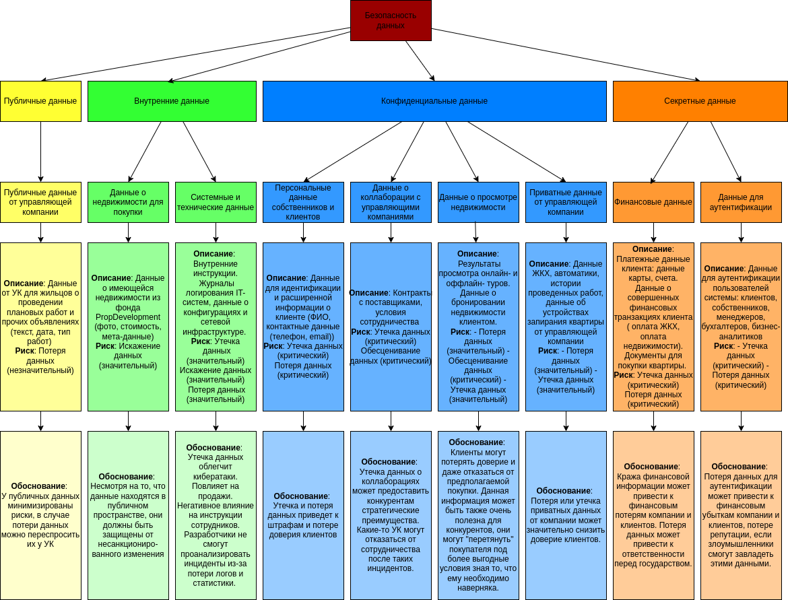

# Задание 1. Разработка проверочного листа по безопасности данных

### Текущая схема

### Задание

Первым делом нужно разработать проверочный лист по безопасности данных. Сейчас это ключевая проблема компании и самое
уязвимое место.

# Решение

## Анализ диаграммы и описание системы PropDevelopment

### Данные о недвижимости для покупки

- **Описание:** Данные о имеющейся недвижимости из фонда PropDevelopment (фото, стоимость, мета-данные)
- **Классификация:** Внутренние данные по ISO/IEC 27001
- **Риск:**
    - Искажение данных (значительный)
- **Обоснование:** Несмотря на то, что данные находятся в публичном пространстве, они должны быть защищены от
  несанкционированного изменения

### Публичные данные от управляющей компании

- **Описание:** Данные от УК для жильцов о проведении плановых работ и прочих объявлениях (текст, дата, тип работ)
- **Классификация:** Публичные данные по ISO/IEC 27001
- **Риск:**
    - Потеря данных (незначительный)
- **Обоснование:** У публичных данных минимизированы риски, в случае потери данных можно переспросить их у УК

### Системные и технические данные

- **Описание:** Внутренние инструкции для менеджеров, бухгалтеров, менеджеров, разработчиков. Журналы логирования
  IT-систем, данные о конфигурациях оборудования, информация о сетевой инфраструктуре
- **Классификация:** Внутренние данные по ISO/IEC 27001
- **Риск:**
    - Утечка данных (значительный)
    - Искажение данных (значительный)
    - Потеря данных (значительный)
- **Обоснование:** Несанкционированная утечка внутренних данных может облегчить кибератаки, может раскрыть поведение
  менеджеров и другую информацию, которая может негативно повлиять на продажи для компании. Искажение данных о
  внутренних инструкциях может негативно повлиять на поведение сотрудников по видоизмененным инструкциям. Потеря данных
  потребует восстановлениях данных, которое стоит денег. Потеря информации о логах ведет к тому, что сотрудники не
  смогут анализировать прошлые произошедшие инциденты и потеряют данные о статистике.

### Персональные данные собственников и клиентов

- **Описание:** Данные для идентификации и расширенной информации о клиенте (ФИО, контактные данные (телефон, email))
- **Классификация:** Конфиденциальные данные по ISO/IEC 27001
- **Риск:**
    - Утечка данных (критический)
    - Потеря данных (критический)
- **Обоснование:** Утечка и потеря данных приведет к штрафам и потере доверия клиентов

### Данные о коллаборации с управляющими компаниями

- **Описание:** Контракты с поставщиками, условия сотрудничества
- **Классификация:** Конфиденциальные данные по ISO/IEC 27001
- **Риск:**
    - Утечка данных (критический)
    - Обесценивание данных (критический)
- **Обоснование:** Утечка данных о коллаборациях может предоставить конкурентам стратегические преимущества. Какие-то УК
  могут отказаться от сотрудничества после таких инцидентов.

### Финансовые данные

- **Описание:** Платежные данные клиента: данные карты, счета. Данные о совершенных финансовых транзакциях клиента (
  оплата ЖКХ, оплата недвижимости). Документы для покупки квартиры.
- **Классификация:** Секретные данные по ISO/IEC 27001
- **Риск:**
    - Утечка данных (критический)
    - Потеря данных (критический)
- **Обоснование:** Кража финансовой информации может привести к финансовым потерям компании и клиентов. Потеря данных
  может привести к ответственности перед государством.

### Данные для аутентификации

- **Описание:** Данные для аутентификации пользователей системы: клиентов, собственников, менеджеров, бухгалтеров,
  бизнес-аналитиков
- **Классификация:** Секретные данные по ISO/IEC 27001
- **Риск:**
    - Утечка данных (критический)
    - Потеря данных (критический)
- **Обоснование:** Потеря данных для аутентификации может привести к финансовым убыткам компании и клиентов, потере
  репутации, если злоумышленники смогут завладеть этими данными.

### Данные о просмотре недвижимости

- **Описание:** Результаты просмотра онлайн- и оффлайн- туров. Данные о бронировании недвижимости клиентом.
- **Классификация:** Конфиденциальные данные по ISO/IEC 27001
- **Риск:**
    - Потеря данных (значительный)
    - Обесценивание данных (критический)
    - Утечка данных (значительный)
- **Обоснование:** В случае утечки или потери данных, клиенты могут потерять доверие и даже отказаться от предполагаемой
  покупки. Данная информация может быть также очень полезна для конкурентов, они могут "перетянуть" покупателя под более
  выгодные условия зная то, что ему необходимо наверняка.

### Приватные данные от управляющей компании

- **Описание:**Данные ЖКХ, автоматики, истории проведенных работ, данные об устройствах запирания квартиры от
  управляющей компании
- **Классификация:**  Конфиденциальные данные по ISO/IEC 27001
- **Риск:**
    - Потеря данных (значительный)
    - Утечка данных (значительный)
- **Обоснование:** Потеря или утечка приватных данных от компании может значительно снизить доверие клиентов.

# Построение mindmap

https://drive.google.com/file/d/1m-M5_8P6nD3xTHOJwjcgK99SeTqsYrMX/view?usp=sharing