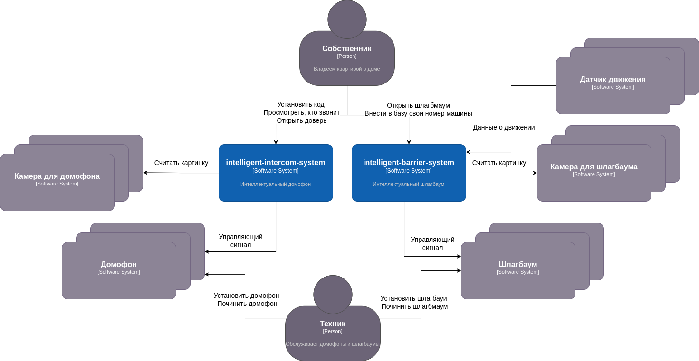
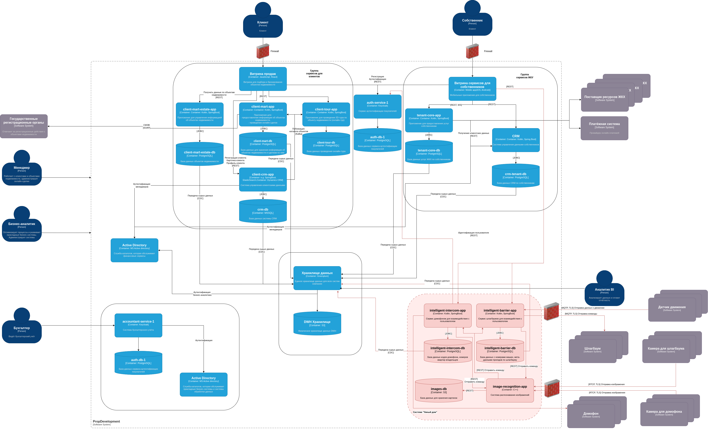

# Задание 3. Внешние интеграции

PropDevelopment хочет расширить бизнес-функции для собственников и жильцов. Компания планирует добавить в систему новые
сервисы «Умный дом». Эти сервисы готов предоставить партнёр.

Вы согласовали техническое задание с бизнесом и выбрали две услуги для внедрения:

- Интеллектуальный домофон. Включает функции классического видеодомофона — открытие по звонку. Также есть возможность
  распознавать пользователей по биометрии (по лицу) и автоматически открывать дверь, если им разрешён доступ в дом.
- Интеллектуальный шлагбаум. Включает функции классического управления шлагбаумом и автоматически открывает доступ, если
  распознаёт номера автомобилей, которым въезд разрешён.

- Новые сервисы должны быть доступны через текущее мобильное приложение, которое используют собственники.

### Текущая схема

# Решение

https://drive.google.com/file/d/1sBLW0GMYb4evFe0nRzKSs7dpxXapJeLC/view?usp=sharing

Две диаграммы в соответствующих вкладках

## Диаграмма контекста C4

На диаграмме контекста умного дома выделено два сервиса - сервис шлагбаума и сервис домофона. Собственник
взаимодействует с сервисами для того, чтобы установить код на домофон, просмотреть, кто звонит, открыть дверь, открыть
шлагбаум и внести в базу свой номер машины. Домофон и шлагбаум должен обслуживать техник от управляющей компании. Сервис
домофоном взаимодействует с устройствами домофонов и с камерами. Сервис шлагбаумов взаимодействует со шлагбаумами,
датчиками движения и камерами.

## Диаграмма контейнеров С4

На существующую диаграмму добавился контур "Умного дома". Система состоит из двух управляющих сервисов со своими базами
данных. Доступ к обоим сервисам для собственника предоставляется через уже имеющуюся витрину сервисом для собственников.
Данные из реляционных БД сервисов поступают в общее хранилище всех данных. Также в системе есть сервис распознавания
изображений, который взаимодействует с хранилищем S3.

## Cписок требований, которым должны удовлетворить внешние интеграции

### Требования к безопасности

1) Данные о биометрии пользователей сохраняются в сервисе авторизации, в зашифрованном виде согласно установленному
   протоколу безопасности
2) Данные о биометрии пользователей токенизируются
3) Система распознавания данных обучается на токенизированных данных о биометрии пользователя из хранилища и на
   основании данных S3
4) Настроена система SCIM для отслеживания проблем с безопасностью в системе умного дома

### Протоколы аутентификации и авторизации

1) Взаимодействие с датчиками движений, со шлагбаумом и с домофоном происходит по безопасному протоколу MQTP с TLS
2) Получение данных с камер происходит по RTCP поверх TLS

### Взаимодействие между системами предприятия и внешней платформой

1) Между системой умного дома и внешними ресурсами настроен файервол
2) Все данные передаются в зашифрованном виде по безопасным протоколам
